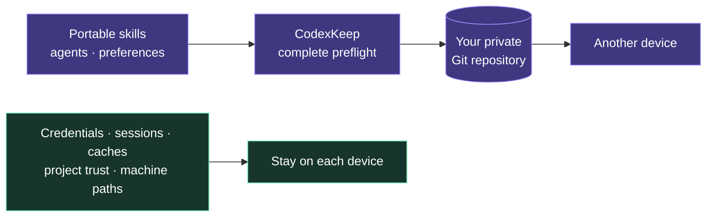

<p align="center">
  <a href="https://github.com/HenryOoO/codexkeep/blob/main/README.md"><strong>English</strong></a>
  ·
  <a href="https://github.com/HenryOoO/codexkeep/blob/main/README.zh-CN.md">简体中文</a>
</p>

<p align="center">
  
</p>

<p align="center">
  <a href="https://www.npmjs.com/package/codexkeep"></a>
  <a href="https://www.npmjs.com/package/codexkeep"></a>
  <a href="https://github.com/HenryOoO/codexkeep/blob/main/LICENSE"></a>
</p>

CodexKeep is a small, unofficial CLI that keeps personal Codex skills, global
instructions, custom agents, portable preferences, and selected plugin
inventory synchronized through a private Git repository that you control.

> CodexKeep is not affiliated with or endorsed by OpenAI. The first release
> requires macOS, Git, and Node.js 22 or newer.

## 30-second start

```bash
npm install -g codexkeep
codexkeep
```

Running `codexkeep` opens the interactive menu. The CLI currently displays
these actions in Chinese:

```text
● 同步配置              Sync configuration
○ 升级并同步            Update sources and sync
○ 查看状态              Check status
○ 连接或查看远程仓库     Connect or inspect remote repository
○ 连接当前设备           Link this device
○ 初始化                Initialize
```

Create an empty private Git repository before setting up cross-device sync.
CodexKeep can also begin in local-only mode and connect a remote later.

## See it sync

<p align="center">
  
</p>

The recording runs the real CLI against an isolated home and a local test Git
remote. No personal configuration, repository, or credential appears in it.

## How it works



The real files live in `~/.codexkeep`. Supported Codex and agents paths point
to that repository through symlinks. Every synchronization is explicit:
CodexKeep validates the repository and links, inspects local and remote state,
shows a plan, and preserves recoverable state if a later step fails.

Only a strict portable allowlist from `config.toml` is reconciled across
devices. Authentication, sessions, caches, machine paths, and other local-only
content never enter the private repository.

## Common workflows

### First device

Create an empty private Git repository, then run:

```bash
codexkeep init git@github.com:your-name/codexkeep-config.git
```

CodexKeep checks the remote and discovers supported local configuration in a
temporary workspace. It shows one initialization plan before installing
`~/.codexkeep`, applying the official-path links, and publishing the first
version.

To start locally:

```bash
codexkeep init
codexkeep remote git@github.com:your-name/codexkeep-config.git
```

Interactive `init` asks whether to connect a remote. Non-interactive
`codexkeep init --yes` stays local-only unless a Git URL is supplied.

### Another device

Use `init`, not `link`, to join an existing repository:

```bash
codexkeep init git@github.com:your-name/codexkeep-config.git
```

The populated remote is cloned and validated in a temporary directory before
any official Codex path changes. Local-only entries are preserved. Genuine
same-name content conflicts require an explicit choice; `--yes` does not choose
a side.

### Daily sync

```bash
codexkeep check
codexkeep sync
```

Run `check` for local diagnostics, then `sync` when you want to reconcile files,
portable preferences, plugin inventory, and Git. Use `update` when third-party
skills and marketplaces should be upgraded before the normal sync.

## Commands at a glance

| Menu action | Command | Network |
| --- | --- | --- |
| Open the menu | `codexkeep` | Depends on the selected action |
| Initialize | `codexkeep init [git-url]` | Only when a remote is selected or supplied |
| Sync configuration | `codexkeep sync` | Fetches and pushes when `origin` exists |
| Update sources and sync | `codexkeep update` | Updates sources, then runs the normal Git sync |
| Check status | `codexkeep check` | Never contacts the Git remote |
| Connect or inspect remote | `codexkeep remote [git-url]` | No argument is local-only; a URL is probed |
| Link this device | `codexkeep link` | Never |

`--yes` accepts routine confirmations for automation. It never bypasses
validation, resolves a content conflict, or replaces an already selected
Codex profile.

## Command reference

<details>
<summary><code>codexkeep</code> — open the interactive menu</summary>

- **Use it when:** you prefer a guided list of actions.
- **Network:** opening the menu itself does not use the network; the selected
  command determines later access.
- **Changes:** none until an action is selected and its own plan is accepted.
- **Confirmation and recovery:** identical to the selected command.

</details>

<details>
<summary><code>codexkeep init [git-url]</code> — initialize this device</summary>

- **Use it when:** setting up the first device, joining an existing CodexKeep
  repository on a new device, or safely merging supported local configuration.
- **Network:** probes the supplied remote. An empty remote becomes the first
  publication target; a populated remote must be a valid CodexKeep repository.
- **Changes:** builds everything in a temporary directory first. After one
  confirmation, it installs `~/.codexkeep`, imports or merges supported
  configuration, applies portable preferences, creates five official-path
  symlinks, commits, and synchronizes when a remote is present.
- **Conflicts:** a populated invalid repository is rejected. Same-name skills,
  agents, global instructions, source records, plugin inventory, or portable
  preferences require an explicit repository/local choice.
- **`--yes`:** skips routine confirmation, but non-interactive content choices
  fall back to cancellation. Without a URL it initializes local-only.
- **Recovery:** unreachable or invalid remotes cause no official-path changes.
  If installation fails after confirmation, the original base config is
  restored and recoverable new repository data is retained under the
  CodexKeep state directory.

</details>

<details>
<summary><code>codexkeep remote [git-url]</code> — inspect or connect a remote</summary>

- **Use it when:** an initialized local repository needs its first remote, an
  empty replacement remote, or a read-only display of the current `origin`.
- **Network:** no argument reads only local Git configuration. A new URL is
  probed before the local remote changes.
- **Changes:** after confirmation, adds or replaces `origin` and enters the
  existing sync flow without asking a second time.
- **Conflicts:** only an empty target repository is accepted. A populated
  CodexKeep repository belongs in `init <git-url>` on a new device. In-progress
  Git operations and incomplete links stop the command.
- **Recovery:** if publication fails, the selected `origin` and local commits
  remain so `codexkeep sync` can retry.

</details>

<details>
<summary><code>codexkeep sync</code> — reconcile configuration and Git</summary>

- **Use it when:** saving local changes, receiving another device's changes, or
  applying the shared configuration to this device.
- **Network:** reads the local Codex plugin inventory and fetches `origin` when
  configured. Fetching happens while building an accurate plan; plugin
  installation and pushes happen only after the plan is accepted.
- **Changes:** can install missing third-party marketplaces and plugins, commit
  local files, rebase onto remote updates, update `plugins.json`, reconcile the
  portable `config.toml` allowlist, back up and update the real Codex config,
  and push Git commits.
- **Conflicts:** incompatible marketplace sources stop before managed content
  changes. Concurrent portable-setting edits require an explicit side.
  Unresolved Git conflicts stop synchronization without force-overwriting
  either side.
- **`--yes`:** accepts the routine sync plan; ambiguous portable settings still
  cancel instead of choosing a side.
- **Recovery:** an offline remote does not prevent local commits. A failed push
  keeps local changes, and a later `codexkeep sync` retries. Account-bound
  plugins are reported for manual installation or sign-in rather than copying
  credentials.

</details>

<details>
<summary><code>codexkeep update</code> — upgrade third-party sources, then sync</summary>

- **Use it when:** sourced global skills and Git-backed plugin marketplaces
  should be upgraded before synchronization.
- **Network:** runs the global skills updater through `npx`, asks Codex to
  upgrade marketplaces, then performs the same remote access as `sync`.
- **Changes:** third-party sources may be updated before the sync plan appears;
  this upgrade phase has no separate confirmation. The normal sync still shows
  its plan unless `--yes` is supplied.
- **Failures:** a skills or marketplace upgrade failure preserves existing
  content and does not prevent the remaining update and sync steps from being
  attempted. Any partial failure returns a non-zero exit status.
- **Recovery:** run `codexkeep check`, fix the reported source or network issue,
  then rerun `update` or use `sync` if no further source upgrade is needed.

</details>

<details>
<summary><code>codexkeep link</code> — restore local configuration links</summary>

- **Use it when:** `~/.codexkeep` already exists but one or more supported
  official-path symlinks are missing.
- **Network:** never.
- **Changes:** validates the complete local repository, lists only missing
  links, and creates them after confirmation.
- **Conflicts:** if an official path already contains different content, the
  command changes nothing and directs you to `codexkeep init` for a safe merge.
- **`--yes`:** accepts creation of non-conflicting missing links.
- **Recovery:** if link creation fails, links created by that run are rolled
  back. Running it again is idempotent.

</details>

<details>
<summary><code>codexkeep check</code> — run read-only local diagnostics</summary>

- **Use it when:** verifying a new device, diagnosing a failed command, or
  checking whether local changes need synchronization.
- **Network:** never contacts the Git remote. It may invoke the installed Codex
  CLI to read local plugin and marketplace inventory.
- **Changes:** none.
- **Checks:** official-path links, accidental non-built-in skills under
  `~/.codex/skills`, plugin inventory, portable preferences, Git repository and
  worktree state, configured `origin`, and the latest technical error record.
- **Recovery:** follow the actionable warning; technical details remain under
  `~/.local/state/codexkeep` rather than being printed with possible sensitive
  subprocess output.

</details>

## What is synchronized

| Synchronized | Always local |
| --- | --- |
| Personal skills in `~/.agents/skills` | Authentication, tokens, connector credentials, MCP headers |
| Skill source records in `.skill-lock.json` | Sessions, history, logs, SQLite databases, caches, desktop state |
| Global `~/.codex/AGENTS.md` | Project trust and machine-specific absolute paths |
| Custom agents in `~/.codex/agents` | Codex built-in skills and plugin bundles or cache snapshots |
| Portable allowlisted preferences | Project-level instructions, skills, and configuration |
| Validated third-party marketplace and plugin inventory | Account-plugin credentials and sign-in state |

The portable scalar allowlist currently includes `model`,
`model_reasoning_effort`, `approval_policy`, `approvals_reviewer`, and
`sandbox_mode`. Boolean feature flags, sanitized skill configuration, and
relative custom-agent config paths can also be portable. Secret-looking keys,
absolute paths, home-relative paths, and machine-only config sections remain
local.

## Data model and links

Real content lives in the private repository:

```text
~/.codexkeep/
├── skills/
├── skill-lock.json
├── plugins.json
└── codex/
    ├── AGENTS.md
    ├── codexkeep.config.toml
    └── agents/
```

Official paths point to it:

```text
~/.agents/skills                    → ~/.codexkeep/skills
~/.agents/.skill-lock.json          → ~/.codexkeep/skill-lock.json
~/.codex/AGENTS.md                  → ~/.codexkeep/codex/AGENTS.md
~/.codex/agents                     → ~/.codexkeep/codex/agents
~/.codex/codexkeep.config.toml      → ~/.codexkeep/codex/codexkeep.config.toml
```

CodexKeep does not take over `~/.codex/skills`; Codex built-ins stay where
Codex installed them.

Current Codex versions only load a named profile when
`--profile codexkeep` is passed and do not support a persistent default-profile
selector. To make synchronized preferences work in the Codex app, CLI, and IDE
without a wrapper command, CodexKeep safely merges its portable allowlist into
the real `~/.codex/config.toml`. Machine-only sections are preserved, and each
changed base config is backed up under `~/.local/state/codexkeep`.

## Failure and recovery

| Situation | What CodexKeep preserves | Next step |
| --- | --- | --- |
| Remote is unreachable during `init` | Existing official paths remain unchanged | Fix access or the URL, then rerun `init` |
| Populated remote is not a valid CodexKeep repository | Local configuration remains unchanged | Use the correct private repository |
| Git conflict appears during `sync` | Both sides remain; no force overwrite | Resolve the Git state, then run `check` and `sync` |
| Push fails | Local commits and selected `origin` remain | Rerun `sync` when the remote is available |
| Applying links fails | Links created by that run are rolled back | Run `check`, fix the reported path, then run `link` |
| A plugin operation fails | File and Git work can still complete | Install or sign in manually, then rerun `sync` |

Machine backups and the latest technical error live under
`~/.local/state/codexkeep` and are excluded from Git.

## Frequently asked questions

### Does the Git repository have to be private?

Local-only use needs no remote. For cross-device synchronization, use a private
repository because it contains personal instructions, skills, agents, and
preferences even though CodexKeep excludes credentials and sessions.

### Should a new device use `init` or `link`?

Use `codexkeep init <git-url>` on a new device. Use `codexkeep link` only when
the local `~/.codexkeep` repository already exists and its official-path
symlinks need to be restored.

### Can npm installation replace the local symlinks?

No. `npm install -g codexkeep` installs the CLI executable. The symlinks connect
official Codex and agents paths to the configuration stored in
`~/.codexkeep`; rerun `codexkeep link` if those links are missing.

### What happens if two devices changed the same preference?

CodexKeep compares the common, local, and remote portable settings. A genuine
two-sided change requires an explicit local/remote choice. `--yes` cancels
instead of guessing.

### Does CodexKeep copy installed plugins?

It synchronizes a validated inventory of supported third-party marketplaces
and plugin IDs. It can ask Codex to install missing non-account plugins.
Bundles, caches, credentials, and account sign-in state stay local.

## Development

```bash
pnpm install
pnpm check
pnpm test
pnpm build
```

Tests use isolated temporary home directories and never touch real user
configuration.

## Release

Stable releases use one interactive command:

```bash
pnpm release
```

The command verifies a clean, synchronized `main`, runs all checks, asks
`bumpp` to select the next semantic version, commits and pushes the version and
tag, and creates a GitHub Release. The Release triggers
`.github/workflows/publish.yml`, which publishes the matching npm package
through npm Trusted Publishing. No long-lived npm write token is stored in
GitHub.
