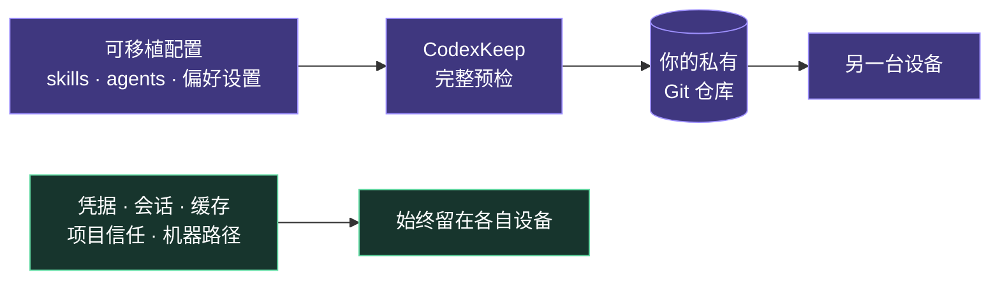

<p align="center">
  <a href="https://github.com/HenryOoO/codexkeep/blob/main/README.md">English</a>
  ·
  <a href="https://github.com/HenryOoO/codexkeep/blob/main/README.zh-CN.md"><strong>简体中文</strong></a>
</p>

<p align="center">
  
</p>

<p align="center">
  <a href="https://www.npmjs.com/package/codexkeep"></a>
  <a href="https://www.npmjs.com/package/codexkeep"></a>
  <a href="https://github.com/HenryOoO/codexkeep/blob/main/LICENSE"></a>
</p>

CodexKeep 是一个小巧、非官方的 CLI，通过你自己控制的私有 Git 仓库同步个人
Codex skills、全局说明、自定义 agents、可移植偏好设置和经过筛选的插件清单。

> CodexKeep 与 OpenAI 没有关联，也未获得 OpenAI 认可。首个版本要求 macOS、
> Git，以及 Node.js 22 或更高版本。

## 30 秒上手

```bash
npm install -g codexkeep
codexkeep
```

直接运行 `codexkeep` 会打开交互菜单：

```text
● 同步配置
○ 升级并同步
○ 查看状态
○ 连接或查看远程仓库
○ 连接当前设备
○ 初始化
```

开始跨设备同步前，请先创建一个空的私有 Git 仓库。CodexKeep 也支持先以纯本地
模式开始，之后再连接远程仓库。

## 看一次真实同步

<p align="center">
  
</p>

这段动画运行的是真实 CLI，但使用了隔离主目录和本地测试 Git 远端。画面中没有
任何个人配置、真实仓库或凭据。

## 工作原理



真实文件保存在 `~/.codexkeep`。Codex 与 agents 的受支持官方路径通过符号链接
指向这个仓库。每次同步都由用户明确发起：CodexKeep 会验证仓库与链接、检查
本地和远程状态、展示计划，并在后续步骤失败时保留可恢复状态。

只有 `config.toml` 中严格允许的可移植字段会在设备间协调。身份认证、会话、
缓存、机器路径和其他本机专属内容永远不会进入私有仓库。

## 常用流程

### 第一台设备

先创建一个空的私有 Git 仓库，然后运行：

```bash
codexkeep init git@github.com:your-name/codexkeep-config.git
```

CodexKeep 会检查远程仓库，并在临时工作区发现受支持的本机配置。它会先展示一份
完整初始化计划，确认后才安装 `~/.codexkeep`、应用官方路径链接并发布第一个
版本。

也可以先只在本机使用：

```bash
codexkeep init
codexkeep remote git@github.com:your-name/codexkeep-config.git
```

交互式 `init` 会询问是否连接远端。非交互式
`codexkeep init --yes` 在没有传入 Git URL 时保持纯本地模式。

### 另一台设备

加入已有仓库时使用 `init`，而不是 `link`：

```bash
codexkeep init git@github.com:your-name/codexkeep-config.git
```

在修改任何 Codex 官方路径之前，CodexKeep 会把已有远程仓库克隆到临时目录并
完成验证。本机专属内容会保留。真正的同名内容冲突必须由用户明确选择；
`--yes` 不会擅自选择一方。

### 日常同步

```bash
codexkeep check
codexkeep sync
```

先用 `check` 做本机诊断，需要协调文件、可移植偏好、插件清单和 Git 时再运行
`sync`。如果希望先升级第三方 skills 和 marketplaces，再执行普通同步，则使用
`update`。

## 命令速查

| 菜单操作 | 命令 | 网络访问 |
| --- | --- | --- |
| 打开菜单 | `codexkeep` | 取决于随后选择的操作 |
| 初始化 | `codexkeep init [git-url]` | 仅在选择或提供远端时 |
| 同步配置 | `codexkeep sync` | 配置了 `origin` 时 fetch 与 push |
| 升级并同步 | `codexkeep update` | 先升级来源，再执行普通 Git 同步 |
| 查看状态 | `codexkeep check` | 从不访问 Git 远端 |
| 连接或查看远程仓库 | `codexkeep remote [git-url]` | 无参数只读本机；提供 URL 时会探测 |
| 连接当前设备 | `codexkeep link` | 从不联网 |

`--yes` 可以为自动化接受常规确认，但不会绕过验证、替用户解决内容冲突，或覆盖
已经选定的 Codex profile。

## 完整命令说明

<details>
<summary><code>codexkeep</code> — 打开交互菜单</summary>

- **适用场景：** 希望通过操作列表引导完成任务。
- **网络：** 打开菜单本身不联网；后续网络访问由选中的命令决定。
- **改动：** 选择操作并接受对应计划前没有改动。
- **确认与恢复：** 与最终选中的命令完全相同。

</details>

<details>
<summary><code>codexkeep init [git-url]</code> — 初始化当前设备</summary>

- **适用场景：** 设置第一台设备、在新设备加入已有 CodexKeep 仓库，或安全合并
  受支持的本机配置。
- **网络：** 探测传入的远端。空仓库会成为首次发布目标；已有内容的仓库必须是
  有效的 CodexKeep 仓库。
- **改动：** 先在临时目录构建所有内容。一次确认后，安装 `~/.codexkeep`，
  导入或合并受支持配置，应用可移植偏好，创建五个官方路径符号链接，提交；存在
  远端时继续同步。
- **冲突：** 已有内容但无效的仓库会被拒绝。同名 skills、agents、全局说明、
  来源记录、插件清单或可移植偏好发生差异时，必须明确选择仓库版本或本机版本。
- **`--yes`：** 跳过常规确认，但非交互环境中的内容选择会回退为取消。没有
  Git URL 时只初始化本机。
- **恢复：** 远端无法访问或无效时不修改官方路径。如果确认后的安装失败，原始
  基础配置会恢复，新仓库数据保存在 CodexKeep 状态目录中以便找回。

</details>

<details>
<summary><code>codexkeep remote [git-url]</code> — 查看或连接远程仓库</summary>

- **适用场景：** 已初始化的本地仓库需要连接第一个远端、更换为空仓库的远端，
  或只读查看当前 `origin`。
- **网络：** 不带参数时只读取本地 Git 配置；新的 URL 会在修改本地远端前被
  探测。
- **改动：** 确认后添加或替换 `origin`，随后直接进入现有同步流程，不会再次
  询问。
- **冲突：** 目标必须是空仓库。已有内容的 CodexKeep 仓库应在新设备上通过
  `init <git-url>` 使用。未完成的 Git 操作或不完整链接会阻止本命令。
- **恢复：** 如果发布失败，选中的 `origin` 和本地提交都会保留，之后可以通过
  `codexkeep sync` 重试。

</details>

<details>
<summary><code>codexkeep sync</code> — 协调配置与 Git</summary>

- **适用场景：** 保存本机改动、接收其他设备的改动，或把共享配置应用到当前
  设备。
- **网络：** 读取本机 Codex 插件清单，并在配置了 `origin` 时执行 fetch。
  fetch 用于生成准确计划；插件安装与 push 只在接受计划后进行。
- **改动：** 可能安装缺少的第三方 marketplaces 和 plugins、提交本地文件、
  rebase 远程更新、更新 `plugins.json`、协调可移植 `config.toml` 白名单、
  备份并修改真实 Codex 配置，以及推送 Git 提交。
- **冲突：** 不兼容的 marketplace 来源会在受管理内容改动前停止。同一可移植
  设置被多方修改时必须明确选边。未解决的 Git 冲突会让同步停止，不会强制覆盖
  任意一方。
- **`--yes`：** 接受常规同步计划；存在歧义的可移植设置仍会取消，而不是自动
  选边。
- **恢复：** 远端离线不妨碍保存本地提交。push 失败时保留本机改动，稍后重新
  运行 `codexkeep sync` 即可。账号绑定的插件只会提示手工安装或登录，不会复制
  凭据。

</details>

<details>
<summary><code>codexkeep update</code> — 升级第三方来源并同步</summary>

- **适用场景：** 希望在同步前升级带来源记录的全局 skills 和 Git-backed
  plugin marketplaces。
- **网络：** 通过 `npx` 运行全局 skills 更新器，请 Codex 升级 marketplaces，
  然后执行与 `sync` 相同的远程访问。
- **改动：** 第三方来源可能在同步计划出现之前就完成升级；升级阶段没有单独
  确认。普通同步仍会展示计划，除非提供 `--yes`。
- **失败：** skills 或 marketplace 升级失败时保留现有内容，并继续尝试其余
  升级与同步步骤。任何部分失败都会返回非零状态。
- **恢复：** 运行 `codexkeep check`，解决来源或网络问题后重新执行 `update`；
  如果不需要再次升级来源，也可以只运行 `sync`。

</details>

<details>
<summary><code>codexkeep link</code> — 恢复本机配置链接</summary>

- **适用场景：** `~/.codexkeep` 已存在，但一个或多个受支持的官方路径符号链接
  缺失。
- **网络：** 从不联网。
- **改动：** 验证完整本地仓库，只列出缺失链接，确认后再创建。
- **冲突：** 如果官方路径已经包含不同内容，命令不会修改任何内容，并提示通过
  `codexkeep init` 做安全合并。
- **`--yes`：** 自动确认创建不存在冲突的缺失链接。
- **恢复：** 链接创建失败时，本次已经创建的链接会回滚。重复运行是幂等的。

</details>

<details>
<summary><code>codexkeep check</code> — 执行只读本机诊断</summary>

- **适用场景：** 验证新设备、诊断失败命令，或检查本机是否存在待同步改动。
- **网络：** 从不访问 Git 远端。它可能调用已安装的 Codex CLI 读取本机 plugin
  与 marketplace 清单。
- **改动：** 无。
- **检查内容：** 官方路径链接、`~/.codex/skills` 下意外出现的非内置 skills、
  插件清单、可移植偏好、Git 仓库与工作区状态、已配置的 `origin`，以及最近的
  技术错误记录。
- **恢复：** 按照可操作警告处理。技术详情保存在
  `~/.local/state/codexkeep`，避免把可能含有敏感信息的子进程输出直接展示在
  主界面。

</details>

## 会同步什么

| 会同步 | 始终留在本机 |
| --- | --- |
| `~/.agents/skills` 中的个人 skills | 身份认证、token、connector 凭据、MCP headers |
| `.skill-lock.json` 中的 skill 来源记录 | 会话、历史、日志、SQLite 数据库、缓存和桌面状态 |
| 全局 `~/.codex/AGENTS.md` | 项目信任与机器专属绝对路径 |
| `~/.codex/agents` 中的自定义 agents | Codex 内置 skills、plugin bundles 和缓存快照 |
| 白名单允许的可移植偏好 | 项目级 instructions、skills 和配置 |
| 验证过的第三方 marketplace 与 plugin 清单 | 账号插件凭据与登录状态 |

当前可移植标量白名单包括 `model`、`model_reasoning_effort`、
`approval_policy`、`approvals_reviewer` 和 `sandbox_mode`。布尔 feature
flags、经过清理的 skill 配置和相对路径的自定义 agent 配置也可以同步。
疑似机密的键、绝对路径、以 `~` 开头的路径和机器专属配置段始终留在本机。

## 数据模型与链接

真实内容保存在私有仓库：

```text
~/.codexkeep/
├── skills/
├── skill-lock.json
├── plugins.json
└── codex/
    ├── AGENTS.md
    ├── codexkeep.config.toml
    └── agents/
```

官方路径指向这些内容：

```text
~/.agents/skills                    → ~/.codexkeep/skills
~/.agents/.skill-lock.json          → ~/.codexkeep/skill-lock.json
~/.codex/AGENTS.md                  → ~/.codexkeep/codex/AGENTS.md
~/.codex/agents                     → ~/.codexkeep/codex/agents
~/.codex/codexkeep.config.toml      → ~/.codexkeep/codex/codexkeep.config.toml
```

CodexKeep 不会接管 `~/.codex/skills`；Codex 内置 skills 继续保留在 Codex 安装
它们的位置。

当前 Codex 版本只有在传入 `--profile codexkeep` 时才加载具名 profile，并不
支持持久化默认 profile 选择器。为了让同步后的偏好在 Codex app、CLI 和 IDE
中无需包装命令即可生效，CodexKeep 会把可移植白名单安全合并到真实的
`~/.codex/config.toml`。机器专属配置段会保留；每次基础配置发生变化前，原文件
都会备份到 `~/.local/state/codexkeep`。

## 失败与恢复

| 情况 | CodexKeep 会保留什么 | 下一步 |
| --- | --- | --- |
| `init` 时远端不可访问 | 现有官方路径保持不变 | 修复权限或 URL，然后重试 `init` |
| 已有内容的远端不是有效 CodexKeep 仓库 | 本机配置保持不变 | 使用正确的私有仓库 |
| `sync` 遇到 Git 冲突 | 双方都保留，不强制覆盖 | 解决 Git 状态，再运行 `check` 和 `sync` |
| push 失败 | 本地提交和选中的 `origin` 保留 | 远端恢复后重新运行 `sync` |
| 应用链接失败 | 本次创建的链接会回滚 | 运行 `check`，修复路径后运行 `link` |
| plugin 操作失败 | 文件与 Git 工作仍可能完成 | 手工安装或登录，然后重试 `sync` |

机器备份和最近一次技术错误保存在 `~/.local/state/codexkeep`，不会进入 Git。

## 常见问题

### Git 仓库必须是私有的吗？

纯本地使用不需要远端。跨设备同步应使用私有仓库，因为即使 CodexKeep 排除了
凭据和会话，仓库里仍会包含个人 instructions、skills、agents 和偏好设置。

### 新设备应该使用 `init` 还是 `link`？

新设备使用 `codexkeep init <git-url>`。只有本机已经存在 `~/.codexkeep`
仓库、需要恢复官方路径符号链接时，才使用 `codexkeep link`。

### npm 安装能代替本地符号链接吗？

不能。`npm install -g codexkeep` 安装的是 CLI 可执行文件；符号链接负责把
Codex 和 agents 的官方路径连接到 `~/.codexkeep` 中保存的配置。如果链接缺失，
请重新运行 `codexkeep link`。

### 两台设备修改了同一个偏好会怎样？

CodexKeep 会比较共同版本、本机版本和远端版本。真正的双边修改必须明确选择
本机或远端；`--yes` 会取消，而不是猜测。

### CodexKeep 会复制已经安装的 plugins 吗？

它会同步经过验证的第三方 marketplace 和 plugin ID 清单，并可以请求 Codex
安装缺少的非账号插件。bundles、缓存、凭据和账号登录状态始终留在本机。

## 开发

```bash
pnpm install
pnpm check
pnpm test
pnpm build
```

测试使用隔离的临时主目录，绝不会触碰真实用户配置。

## 发布

稳定版本只使用一个交互式命令：

```bash
pnpm release
```

该命令会验证干净且与远端同步的 `main`，运行全部检查，通过 `bumpp` 交互选择
下一个语义化版本，提交并推送版本与 tag，再创建 GitHub Release。Release 会
触发 `.github/workflows/publish.yml`，通过 npm Trusted Publishing 发布对应
npm 包。GitHub 中不会保存长期 npm 写入 token。
